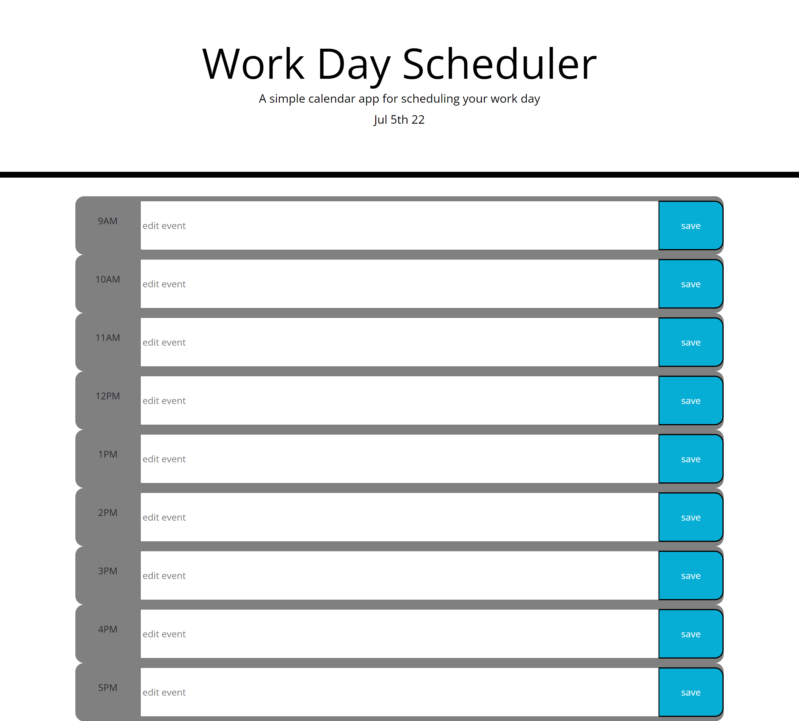

# [Daily Event Planner](https://b-alt-del.github.io/Daily-Event-Planner/) is a web application to help organize your daily event schedule.

The employer has given the task of creating a way to organize daily events and by saving the data to the local storage so that the info is still there upon page reload. It is a simple 9-5 event scheduler with editable events organized by data. The calender connects to a time and date API so that the events have indications as to if they have already past, are in the current hour or are yet to come. 


## Acceptance Criteria

```
GIVEN I am using a daily planner to create a schedule
WHEN I open the planner
THEN the current day is displayed at the top of the calendar
WHEN I scroll down
THEN I am presented with timeblocks for standard business hours
WHEN I view the timeblocks for that day
THEN each timeblock is color coded to indicate whether it is in the past, present, or future
WHEN I click into a timeblock
THEN I can enter an event
WHEN I click the save button for that timeblock
THEN the text for that event is saved in local storage
WHEN I refresh the page
THEN the saved events persist
```



